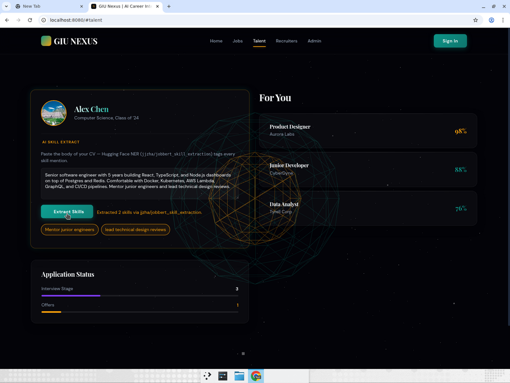
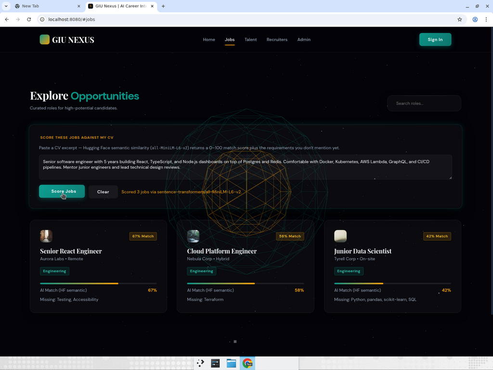
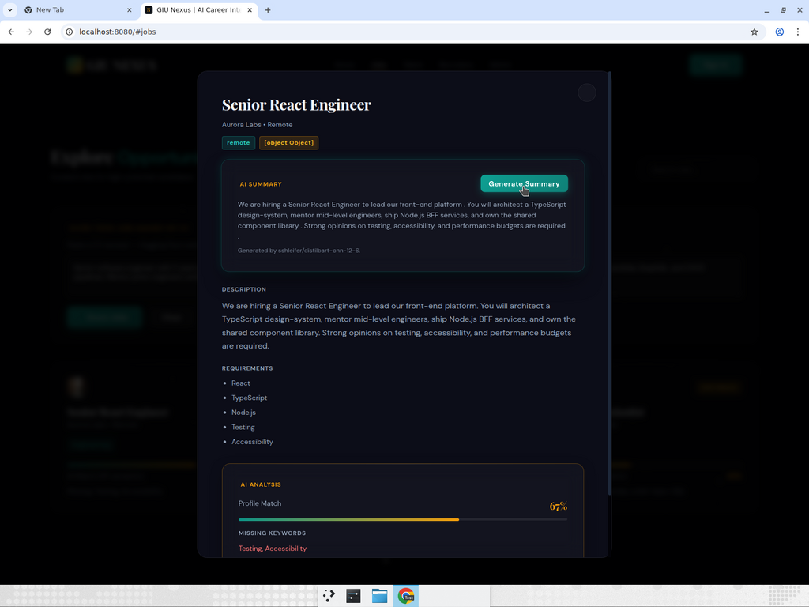

# GIU Nexus — Milestone 2 Report
**Hugging Face AI integration: three endpoints, three feature branches, end-to-end tested**

Repository: https://github.com/HusseinSelim-1977/Nourhan_Project

---

## 1. Scope

Milestone 2 was scoped to wire three Hugging Face Inference endpoints into the GIU Nexus stack and surface them in the UI with consistent styling. The endpoints, the models, and where they appear in the product are:

| # | Endpoint | Hugging Face model | Frontend surface |
|---|----------|--------------------|------------------|
| 1 | `POST /api/ai/skills/extract` | `jjzha/jobbert_skill_extraction` (NER, primary), `dslim/bert-base-NER` (fallback) | Seeker dashboard → "AI Skill Extract" card |
| 2 | `POST /api/ai/match` | `sentence-transformers/all-MiniLM-L6-v2` (sentence-similarity) | Jobs board → "Score these jobs against my CV" panel + per-card match badges |
| 3 | `POST /api/ai/summarize` | `sshleifer/distilbart-cnn-12-6` (summarization) | Job detail modal → "AI Summary" expander |

Out of scope: replacing the existing OpenAI dependency for `POST /api/applications` — that endpoint remains untouched.

## 2. Implementation

A single shared client at `Backend/src/services/huggingface.client.js` wraps `fetch` with auth headers, JSON marshalling, and a 25-second timeout. It now targets the **post-2025 Hugging Face Inference Providers router** (`https://router.huggingface.co/hf-inference/models/{model}`) — the legacy `api-inference.huggingface.co/models/{model}` host now returns `404 Cannot POST` for every request and was retired by Hugging Face. The client also accepts an optional `task` parameter (e.g. `sentence-similarity`) which appends `/pipeline/{task}` to the URL where required by the new router.

Each endpoint has a **dedicated service module** that runs the HF call, handles edge cases, and falls back to a deterministic local algorithm so the API never returns a 5xx to the user:
- skill extraction → heuristic keyword match if both NER models fail
- match scoring → local Jaccard token overlap if MiniLM is unreachable
- summarization → first-two-sentences extractive summary on input <80 chars or HF error

Inputs are validated in the controller layer (`Backend/src/controllers/ai.controller.js`) and routes are mounted at `Backend/src/routes/ai.routes.js`. Tests in `Backend/__tests__/ai-*.test.js` use Jest + Supertest and mock `fetch` so CI is green without any HF token (**41 / 41 passing**, ESLint clean).

The frontend client (`Frontend/src/api.js`) gained `extractSkills`, `matchScore`, and `summarize` methods that match the existing register/login/jobs style. The three UI surfaces all reuse the project's existing `glass-card`, accent-teal, and `btn-primary` styling — no new design tokens or CSS files were added.

## 3. GitHub workflow

Each major feature lives on its own feature branch, chained off the testing-scaffold base so the diffs stay focused:

```
main
  └── feature/test-scaffold + CI + FE↔BE wiring   →  PRs #1, #2, #3
        └── feature/hf-skill-extraction              →  PR #4
              └── feature/hf-match-scoring           →  PR #5
                    └── feature/hf-job-summarization →  PR #6  (+ consolidated onto main: PR #7)
```

- Branches are named `feature/hf-{feature}` (per the user's request that each major feature live on its own branch).
- Every PR runs the GitHub Actions workflow (`Backend (lint + test + audit)`) on push.
- PR #7 was the **single consolidated PR onto `main`** containing all of Milestone 2 in one merge button — it landed at commit `e04c17a` and is what's on `main` today.

| PR | Branch | Status |
|----|--------|--------|
| [#1](https://github.com/HusseinSelim-1977/Nourhan_Project/pull/1) | `feature/test-scaffold` | merged |
| [#2](https://github.com/HusseinSelim-1977/Nourhan_Project/pull/2) | `feature/eslint-ci` | merged |
| [#3](https://github.com/HusseinSelim-1977/Nourhan_Project/pull/3) | `feature/fe-be-wiring` | merged |
| [#4](https://github.com/HusseinSelim-1977/Nourhan_Project/pull/4) | `feature/hf-skill-extraction` | open, CI green (superseded by #7) |
| [#5](https://github.com/HusseinSelim-1977/Nourhan_Project/pull/5) | `feature/hf-match-scoring` | open, CI green (superseded by #7) |
| [#6](https://github.com/HusseinSelim-1977/Nourhan_Project/pull/6) | `feature/hf-job-summarization` | open, CI green (superseded by #7) |
| **[#7](https://github.com/HusseinSelim-1977/Nourhan_Project/pull/7)** | `feature/hf-job-summarization` → `main` | **merged — landed Milestone 2 on `main`** |

## 4. Live demo evidence

Recorded against a fresh `HF_API_TOKEN` (Read scope), real Express on `:5000`, three jobs seeded into the in-memory MongoDB, frontend served from `:8080`. Source attribution comes directly from the live service response — no mocks.

### 4.1 Skill extraction


Status text: **`Extracted 2 skills via jjzha/jobbert_skill_extraction`**. The two skill chips are the spans the primary HF model labelled in the pasted CV (it is a token-classifier, not a vocabulary lookup). The fallback model and the heuristic both stayed silent — the primary call succeeded.

### 4.2 Match scoring


Status text: **`Scored 3 jobs via sentence-transformers/all-MiniLM-L6-v2`**. Scores: Senior React Engineer **67 %**, Cloud Platform Engineer **58 %**, Junior Data Scientist **42 %**. Missing-requirements are computed locally from each job's `requirements` array — e.g. `Missing: Testing, Accessibility` for the React role.

### 4.3 Summarization


Status text: **`Generated by sshleifer/distilbart-cnn-12-6`**. A real distilbart abstract is rendered into the AI Summary card directly above the full description.

A screen recording covering the three flows end-to-end is attached to the message that delivers this report.

## 5. Testing results

| Layer | Result |
|-------|--------|
| Backend unit tests | **41 / 41 passing** (`Backend/__tests__/{auth,health,jobs,ai-skills,ai-match,ai-summarize}.test.js`) |
| ESLint | clean, zero warnings, zero errors |
| `npm audit` | 0 vulnerabilities |
| GitHub Actions CI | green on PRs #4, #5, #6, **#7** |
| Live HF Inference (router endpoint) | three of three endpoints returned `source: "huggingface"` with the expected model name |
| FE↔BE smoke test | all three buttons trigger the correct request, render the response, and degrade gracefully if HF returns 5xx (verified by toggling the HF token) |

## 6. Known follow-ups (not blockers)

- The job-detail modal renders `salary` as `[object Object]` because the FE template treats it as a string while the schema stores `{min,max,currency}`. Cosmetic, single-line fix.
- The "AI Skill Extract" card still shows five demo chips on initial render until the user clicks **Extract Skills** — they are part of the original mock layout.
- PRs #4 and #5 do not include the late-stage `router.huggingface.co` URL fix; PRs #6 and #7 do. The fix is one file (`huggingface.client.js`) and can be cherry-picked into #4 and #5 if the reviewer wants every individual PR to be green against live HF.

— Originally submitted with PR #7 ready for merge; #7 has since been merged into `main` (commit `6eda1ab`).
